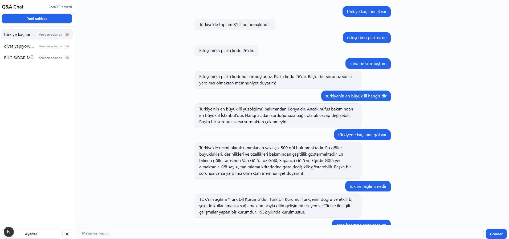
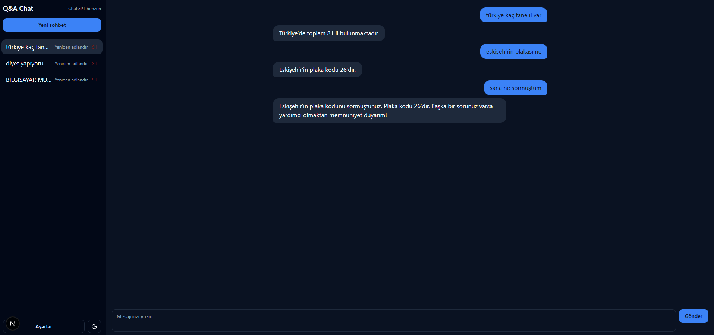
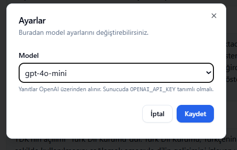

# 📌 Q&A Chat Project

ChatGPT benzeri soru-cevap uygulaması.  
Kullanıcıların yazdığı sorular OpenAI API üzerinden işlenir ve yanıtlar sohbet ekranında gösterilir.  
Sohbet geçmişi saklanabilir, yeni sohbet açılabilir, konuşmalar yeniden adlandırılabilir veya silinebilir.  

---

## 🚀 Kullanılan Teknolojiler
- **Next.js 15** (React framework)
- **TypeScript**
- **TailwindCSS** – modern ve responsive stil
- **shadcn/ui** – hazır UI bileşenleri
- **next-themes** – dark/light tema desteği
- **react-markdown** + **rehype-highlight** – Markdown ve kod blokları için
- **OpenAI Chat Completions API**

---

## ⚙️ Kurulum ve Çalıştırma

1. **Repoyu klonla**
   ```bash
git clone https://github.com/beyzasuner/project-chat-qna.git
cd project-chat-qna


2. **Bağımlıkları yükle**

npm install
veya
yarn install

3. **Ortam değişkenlerini ayarla**
Proje köküne .env.local dosyası ekle ve içine kendi OpenAI API anahtarını yaz:
OPENAI_API_KEY=your-api-key-here


4. **Geliştirme sunucusunu başlat**
npm run dev
Tarayıcıda http://localhost:3000
 açarak uygulamayı kullanabilirsiniz.

 ---

 
## 📖 Özellikler

- 💬 **Mesajlaşma Arayüzü**
  - Kullanıcı ve asistan mesajları farklı baloncuklarda (renk ve hizalama) gösterilir.
  - Markdown desteği sayesinde kod blokları ve formatlı metinler sorunsuz görüntülenir.
  - Uzun metinlerde otomatik kaydırma ve responsive yapı desteklenir.

- ⌨️ **Mesaj Gönderme**
  - `Enter` tuşu → mesaj gönderir.
  - `Shift + Enter` → yeni satır açar.
  - `Ctrl/Cmd + Enter` → alternatif gönderme kısayolu.

- 🆕 **Sohbet Yönetimi**
  - Yeni sohbet başlatılabilir.
  - Mevcut sohbetler yeniden adlandırılabilir.
  - Gereksiz sohbetler silinebilir.
  - Aktif sohbetler arasında hızlı geçiş yapılabilir.

- 💾 **Veri Saklama**
  - Sohbet geçmişi **tarayıcı localStorage** üzerinde saklanır.
  - Sayfa yenilense bile konuşmalar korunur.

- 🎨 **Tema ve Görsellik**
  - Dark/Light tema desteği.
  - Mobil ve masaüstü için **responsive tasarım**.
  - Kullanıcı dostu butonlar, sade ve modern arayüz.

- ⚡ **Diğer Fonksiyonellikler**
  - API’den yanıt beklerken “Yazıyor...” yükleniyor göstergesi.
  - Ayarlar menüsünden kullanılacak **OpenAI modeli** seçilebilir.
  - Otomatik textarea boyutlandırma: yazdıkça büyür, belli bir sınırdan sonra kaydırma çıkar.

